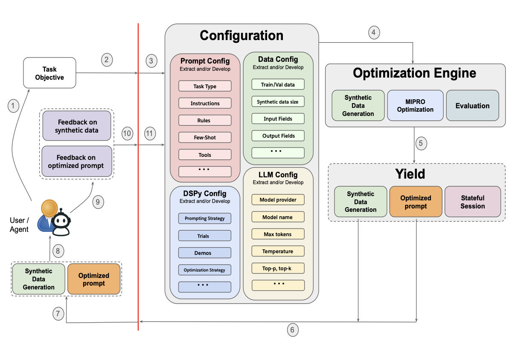

# Promptomatix

## Overview & Motivation
Promptomatix is an automatic prompt optimization framework for Large Language Models (LLMs) that transforms natural language task descriptions into high-quality prompts—no manual tuning or domain expertise required. It addresses the challenges of manual, inconsistent, and inaccessible prompt engineering by automating the full optimization pipeline, making prompt engineering scalable, efficient, and accessible to all users [[arXiv:2507.14241](https://arxiv.org/pdf/2507.14241)].

## Why Promptomatix?
- **Manual prompt engineering is slow, inconsistent, and requires expertise.**
- **LLMs are highly sensitive to prompt variations, making robust design difficult.**
- **Existing tools require heavy configuration and domain knowledge.**
- **Promptomatix democratizes prompt optimization with a zero-configuration, data-driven approach.**

## Key Contributions
- **Zero-configuration interface:** Automates the full prompt optimization workflow from intent analysis to evaluation.
- **Intelligent synthetic data generation:** Eliminates data bottlenecks by generating high-quality, diverse training data.
- **Cost-aware optimization:** Balances prompt quality with computational efficiency, allowing user-controlled trade-offs.
- **Modular, extensible backend:** Supports multiple optimization strategies (meta-prompt, DSPy, and more).
- **Comprehensive evaluation:** Outperforms or matches state-of-the-art libraries across diverse tasks, with reduced computational overhead.

## Architecture & Workflow

  

Promptomatix consists of several key components:
- **Input Processing:** Analyzes user intent and task requirements from natural language.
- **Synthetic Data Generation:** Creates training/testing datasets tailored to the task using advanced LLM prompting.
- **Optimization Engine:** Iteratively refines prompts using DSPy or meta-prompt backends.
- **Evaluation System:** Assesses prompt performance with task-specific, cost-aware metrics.
- **Feedback Integration:** Incorporates human or synthetic feedback for continuous improvement.
- **Session Management:** Tracks optimization progress and maintains detailed logs.

## Main Features
- **Automatic prompt optimization** for any LLM task (QA, classification, summarization, generation, etc.)
- **No manual configuration**—just describe your task in natural language
- **Supports multiple LLM providers** (OpenAI, Anthropic, Cohere, etc.)
- **Human and synthetic feedback integration** for iterative improvement
- **Comprehensive session and log management**
- **CLI and Python API interfaces** for flexible usage

## Supported Optimization Strategies
- **Meta-prompt backend:** Lightweight, fast optimization using direct LLM calls and meta-prompting
- **DSPy backend:** Advanced, modular optimization pipeline leveraging DSPy for programmatic prompt compilation and evaluation
- **Cost-aware objective:** Balances performance, prompt length, and complexity for efficient deployment

## Evaluation & Benchmarks
Promptomatix has been evaluated across five major task categories:
- **Mathematical reasoning**
- **Question answering**
- **Classification**
- **Summarization**
- **Text generation**

Results show competitive or superior performance compared to existing libraries, with shorter prompts and lower computational cost. The framework enables robust, reproducible, and scalable prompt engineering for both research and production.

## Reference
For technical details, algorithms, and experimental results, see the official paper:
- [Promptomatix: An Automatic Prompt Optimization Framework for Large Language Models (arXiv:2507.14241)](https://arxiv.org/pdf/2507.14241)